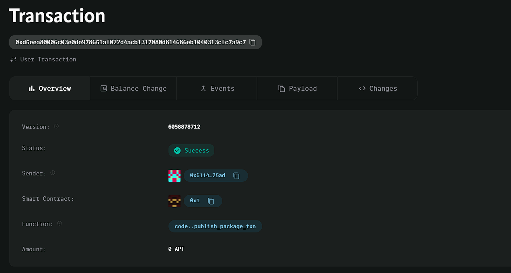

### Deployed smartcontract address: 0xd5eea80006c03e0de978651af022d4acb1317080d814686eb1040313cfc7a9c7

### Screenshot: 

# Decentralized Gig Economy Platform

## Project Title
Decentralized Gig Economy Platform

## Project Description
The Decentralized Gig Economy Platform allows users to post small gigs or freelance jobs, with payments managed by smart contracts. It provides a trustless, transparent environment where freelancers can be paid immediately upon job completion, without intermediaries.

## Vision
Our vision is to create a fair and efficient decentralized platform for gig workers and freelancers. By leveraging blockchain technology, we aim to eliminate the need for intermediaries, ensuring freelancers are paid instantly and fairly, while providing transparency to employers.

## Key Features
- **Post Gigs**: Users can post small gigs or freelance tasks, specifying a reward and description for the job.
- **Smart Contract Payments**: Payments are held in escrow by the smart contract and released to the freelancer once the gig is completed.
- **Transparent Transactions**: All transactions, including gig postings and payouts, are recorded on the blockchain, ensuring transparency.
- **No Intermediaries**: The platform removes the need for centralized intermediaries, reducing fees and ensuring fair compensation for freelancers.

## Future Scope
- **Reputation System**: Develop a reputation system for freelancers and gig posters to build trust and credibility.
- **Milestone Payments**: Implement milestone-based payments for larger gigs, allowing for partial payouts as tasks are completed.
- **Multisig Contracts**: Introduce multisig contracts where both parties must agree before releasing the payment.
- **Global Access**: Expand the platform to support multiple cryptocurrencies and cross-border payments for global gig workers.
- **Analytics and Insights**: Provide users with insights into job completion rates, freelancer performance, and more.

